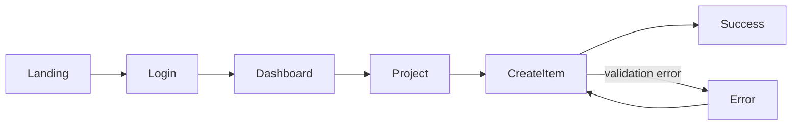

우리는 서비스의 UX맵을 만들어야합니다.
아래 방법으로 진행하세요.
깃허브를 실제로 들어가서 README 및 사용방법을 익혀서 빠짐없이 활용하여 완성하세요.

1. **super-ux 
   기존 코드베이스를 역으로 분석해서 `flows.md`, `screens.md`, `scenarios.md` 같은 UX 문서를 만들고, **Mermaid 사용자 흐름도 + 화면/상태 맵 + 시나리오**를 연결합니다. 기존 서비스의 경우 코드에서 구조를 추론해서 `inferred` 상태로 먼저 채울 수도 있습니다. ([GitHub][1])
   [GitHub — ssheleg/super-ux](https://github.com/ssheleg/super-ux?utm_source=chatgpt.com)

2. **qualia-ux-prompts 
   `user-flow`, `auto-crawl`, `figma-prototype`, `single-screen`용 프롬프트가 따로 있고, 특히 **라이브 제품을 크롤링해 캡처한 화면들을 기반으로 UX를 분석**하는 프롬프트가 있습니다. Claude Code용 `q-visual-audit`, `q-code-audit` skill도 포함되어 있습니다. ([GitHub][2])
   [GitHub — Soba-noodl/qualia-ux-prompts](https://github.com/Soba-noodl/qualia-ux-prompts?utm_source=chatgpt.com)

 **`super-ux + qualia-ux-prompts` 조합**으로 진행하세요.
```text
서비스
├── IA
│   ├── Home
│   ├── Workspace
│   ├── Project
│   └── Settings
│
├── Screens / States
│   ├── SCR-01 Home
│   │   ├── default
│   │   ├── loading
│   │   └── empty
│   └── SCR-02 Project
│
├── User Flows
│   ├── Sign up
│   ├── Create project
│   ├── Invite member
│   └── Upgrade
│
└── Events
    ├── click
    ├── API request
    ├── navigation
    ├── modal
    ├── error
    └── success
```

그리고 Mermaid로:


서비스를 분석시키고, 어느 화면에서 어떤 행동/상태 전이가 발생하는지 한 장의 맵으로 관리”하자.
